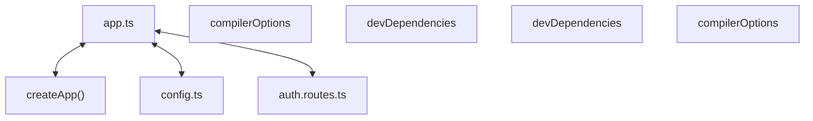

# Codebase Architectural Report

> **Auto-generated** by graphify knowledge graph analysis  
> **Purpose**: Dependency map, connection analysis, subsystem breakdown, and quality hotspots.

---

## 1. Executive Summary

- **Total Components**: `188`
- **Total Connections**: `217`
- **Subsystem Modules**: `1`
- **Dependency Types**: `7`

**Key Architectural Hubs:**

| # | Component | File | Type | Connections |
|---|-----------|------|------|-------------|
| 1 | `app.ts` | `backend/src/app.ts` | file | 15 |
| 2 | `compilerOptions` | `frontend/tsconfig.json` | function | 15 |
| 3 | `devDependencies` | `frontend/package.json` | function | 14 |
| 4 | `devDependencies` | `backend/package.json` | function | 11 |
| 5 | `compilerOptions` | `backend/tsconfig.json` | function | 11 |
| 6 | `createApp()` | `backend/src/app.ts` | method | 8 |
| 7 | `config.ts` | `backend/src/config.ts` | file | 8 |
| 8 | `auth.routes.ts` | `backend/src/features/auth/auth.routes.ts` | file | 8 |

---

## 2. Dependency & Connection Analysis

### Relationship Types

| Relationship | Count | Share |
|-------------|-------|-------|
| `contains` | 112 | 52% |
| `imports` | 52 | 24% |
| `imports_from` | 18 | 8% |
| `calls` | 14 | 6% |
| `extends` | 12 | 6% |
| `method` | 5 | 2% |
| `references` | 4 | 2% |

### Hub Dependency Diagram

### Most Connected Pairs

| Component A | Component B | Shared Connections |
|-------------|-------------|-------------------|
| `build` | `scripts` | 2 |
| `dev` | `scripts` | 2 |
| `scripts` | `start` | 2 |
| `scripts` | `test` | 2 |
| `@types/node` | `devDependencies` | 2 |
| `devDependencies` | `typescript` | 2 |
| `devDependencies` | `vitest` | 2 |
| `@types/node` | `@types/node` | 2 |
| `typescript` | `typescript` | 2 |
| `vitest` | `vitest` | 2 |

---

## 3. Subsystem & Module Breakdown

### 3.1 backend
**Nodes**: `188`  
**Files**: `backend/package.json`, `backend/src/app.ts`, `backend/src/config.ts`, `backend/src/db/database.ts`, `backend/src/features/auth/auth.routes.ts`, `backend/src/features/auth/auth.service.ts` +19 more

| Component | Type | File | Connections |
|-----------|------|------|-------------|
| `app.ts` | file | `backend/src/app.ts` | 15 |
| `compilerOptions` | function | `frontend/tsconfig.json` | 15 |
| `devDependencies` | function | `frontend/package.json` | 14 |
| `devDependencies` | function | `backend/package.json` | 11 |
| `compilerOptions` | function | `backend/tsconfig.json` | 11 |
| `createApp()` | method | `backend/src/app.ts` | 8 |
| `config.ts` | file | `backend/src/config.ts` | 8 |
| `auth.routes.ts` | file | `backend/src/features/auth/auth.routes.ts` | 8 |
| `auth.service.ts` | file | `backend/src/features/auth/auth.service.ts` | 8 |
| `dependencies` | function | `backend/package.json` | 7 |

---

## 4. API Reference

Public classes and functions by subsystem.

### backend

| Name | Type | File | Connections |
|------|------|------|-------------|
| `compilerOptions` | function | `frontend/tsconfig.json` | 15 |
| `devDependencies` | function | `frontend/package.json` | 14 |
| `devDependencies` | function | `backend/package.json` | 11 |
| `compilerOptions` | function | `backend/tsconfig.json` | 11 |
| `dependencies` | function | `backend/package.json` | 7 |
| `AuthService` | class | `backend/src/features/auth/auth.service.ts` | 7 |
| `backend/package.json` | function | `backend/package.json` | 6 |
| `HttpError` | class | `backend/src/middleware/error-handler.ts` | 6 |

---

## 5. Code Quality & Architectural Risk Hotspots

### Component Type Distribution

| Type | Count | Share |
|------|-------|-------|
| function | 134 | 71% |
| class | 20 | 11% |
| method | 18 | 10% |
| file | 16 | 9% |

### Dependency Cycles

**44** circular dependency loop(s) detected:

| # | Cycle Path |
|---|-----------|
| 1 | `frontend_src_lib_api → frontend_src_lib_api_request → frontend_src_lib_api_verifyotp` |
| 2 | `frontend_src_features_booking_bookingflow → frontend_src_lib_api_beginlogin → frontend_src_lib_api_request → frontend_src_lib_api_verifyotp` |
| 3 | `frontend_src_lib_api → frontend_src_lib_api_beginlogin → frontend_src_lib_api_request` |
| 4 | `frontend_src_features_booking_bookingflow → frontend_src_lib_api → frontend_src_lib_api_verifyotp` |
| 5 | `frontend_src_features_booking_bookingflow_bookingflow → frontend_src_features_booking_bookingflow_test → frontend_src_features_booking_bookingflow` |
| 6 | `frontend_app_page → frontend_src_features_booking_bookingflow_bookingflow → frontend_src_features_booking_bookingflow` |
| 7 | `frontend_package_devdependencies_types_node → backend_package_json_types_node → backend_package_devdependencies_types_node → backend_package_devdependencies → backend_package_devdependencies_typescript → backend_package_json_typescript → frontend_package_devdependencies_typescript → frontend_package_devdependencies` |
| 8 | `backend_tests_auth_test → backend_src_config_getconfig → backend_tests_auth_test_app` |
| 9 | `backend_src_index → backend_src_index_start → backend_src_config_getconfig` |
| 10 | `backend_src_app_createapp → backend_src_index_start → backend_src_config_getconfig → backend_tests_auth_test_app` |

### Orphaned Components

**6** isolated node(s) with no connections:

| Component | File |
|-----------|------|
| `auth.spec.ts` | `frontend/e2e/auth.spec.ts` |
| `postcss.config.mjs` | `frontend/postcss.config.mjs` |
| `vitest.config.ts` | `frontend/vitest.config.ts` |
| `OTP Session` | `todos.yaml` |
| `Catalog Seat Selection` | `todos.yaml` |
| `Payment Booking Confirmation` | `todos.yaml` |

---

## 6. How to Navigate

1. **Interactive D3 Map** — open `graph.html` to explore node connections visually.
2. **Knowledge Graph Queries** — use MCP tools (`graph_query`, `graph_explain_node`, `graph_impact_radius`).
